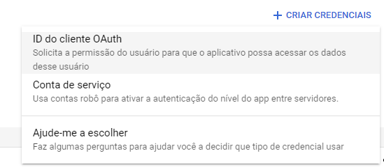
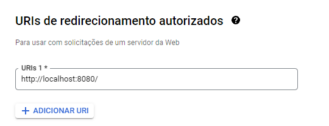
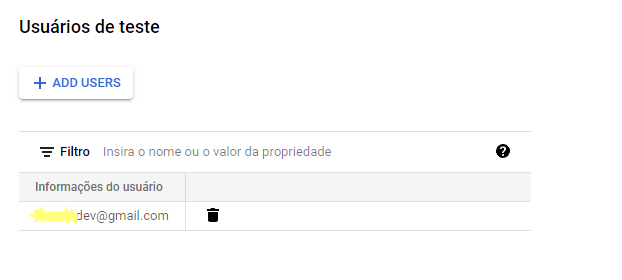
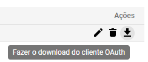

# Backup Postgresql

### Iniciando:

(Windows)

1. `cd %APPDATA%`
2. `mkdir postgresql`
3. `cd postgresql`
4. `notepad pgpass.conf`
5. `localhost:5432:database:user:psswd`

Agora temos um arquivo pgpass para acessar o backup sem pedir senha, isso é interessante para automatizar o processo. Agora iremos criar um arquivo `.bat` para executar o `pg_dump`

```bash
@echo off

setlocal 

echo Configurando variaveis
set DB_USER=eduardo # usuario
set DB_NAME=bicimoto # database
set BACKUP_DIR=C:\Users\Eduar\Documents\backup # pasta de backup
set TIMESTAMP=%DATE:~10,4%-%DATE:~7,2%-%DATE:~4,2%_%TIME:~0,2%-%TIME:~3,2%-%TIME:~6,2% # nome do backup (data)
set BACKUP_FILE=%BACKUP_DIR%\%DB_NAME%\%TIMESTAMP%.tar # caminho do arquivo backup.tar

echo Backup com pg_dump
pg_dump.exe -U %DB_USER% -w -F t %DB_NAME% > "%BACKUP_FILE%"

echo Verificando o backup 
if exist "%BACKUP_FILE%" (
    echo Backup %DB_NAME% realizado com sucesso!
) else (
    echo Erro ao realizar backup!
)

endlocal
```

Dessa forma, ja temos um programa .bat que executa o backup do banco.

Para realizarmos a operção de restauração:

```bash
pg_restore -U postgres -d bicimoto C:\backup\bicimoto.tar
```

## Configurando API:

### Criando um serviço no Google Cloud com a API Drive:

1. Acesse: [Google Cloud](https://console.cloud.google.com/)
2. Crie um projeto novo
3. Acesse: [Google Drive API](https://console.cloud.google.com/apis/library/drive.googleapis.com) e adicione ao projeto
4. Crie uma nova credencial do tipo **ID do Cliente OAuth:**



5. Na configuração da credencial adicione a ****URI de redirecionamento autorizados:****



6. Nas configurações de **tela de permissão OAtuh:**



7. Com a API configurada podemos baixar o arquivo Json com as credenciais de acesso:



8. O nome do arquivo baixado será algo parecido com: `client_secret_5jd89asdh786dgi76uguq6yg.apps.googleusercontent.com` Renomeie para `client_secrets`
9. Mova o `client_secrets.json` para a pasta raiz do script Python.
